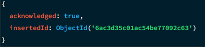

## Actividad 3: Creación de Colecciones con `$jsonSchema`

1. Scripts de creación con validación `$jsonSchema`
```json
// Validacion para la coleccion 'contenidos'
db.createCollection("contenidos", {
  validator: {
    $jsonSchema: {
      bsonType: "object",
      required: ["titulo", "tipo", "anio_lanzamiento", "activo"],
      properties: {
        titulo: {
          bsonType: "string",
          description: "El titulo debe ser una cadena de texto y es obligatorio"
        },
        tipo: {
          enum: ["Pelicula", "Serie", "Documental"],
          description: "El tipo es obligatorio y debe ser uno de los valores permitidos"
        },
        anio_lanzamiento: {
          bsonType: "int",
          minimum: 1895,
          maximum: 2100,
          description: "El anio debe ser un entero entre 1895 y 2100"
        },
        activo: {
          bsonType: "bool",
          description: "Estado de disponibilidad del contenido"
        },
        metadatos: {
          bsonType: "object",
          required: ["duracion_minutos"],
          properties: {
            duracion_minutos: {
              bsonType: "int",
              minimum: 1,
              description: "Duracion mayor a 0"
            }
          }
        }
      }
    }
  },
  validationLevel: "strict",
  validationAction: "error"
});

// Validacion para la coleccion 'usuarios'
db.createCollection("usuarios", {
  validator: {
    $jsonSchema: {
      bsonType: "object",
      required: ["email", "nombre", "cuenta_premium"],
      properties: {
        email: {
          bsonType: "string",
          pattern: "^[a-zA-Z0-9._%+-]+@[a-zA-Z0-9.-]+\\.[a-zA-Z]{2,}$",
          description: "Debe ser un email valido y es obligatorio"
        },
        nombre: {
          bsonType: "string",
          minLength: 2,
          maxLength: 50,
          description: "Nombre del usuario, entre 2 y 50 caracteres"
        },
        cuenta_premium: {
          bsonType: "bool",
          description: "Indica si el usuario paga subscripcion"
        }
      }
    }
  }
});
```
imagen de resultado

### Prueba válida para la colección `contenidos`
```json
db.contenidos.insertOne({
  titulo: "Interstellar",
  tipo: "Pelicula",
  anio_lanzamiento: 2014,
  activo: true,
  metadatos: {
    duracion_minutos: 169
  }
});
```


### Prueba inválida para la colección `usuarios`
```json
db.usuarios.insertOne({
  email: "correo_sin_arroba.com",
  nombre: "A",
  cuenta_premium: false
});
```
