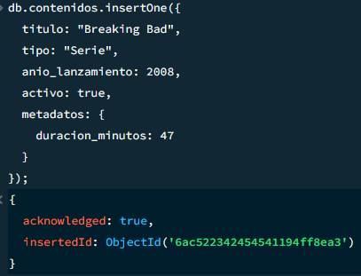
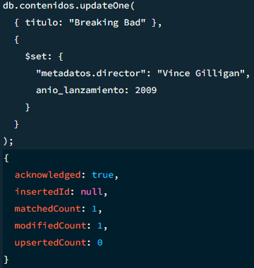
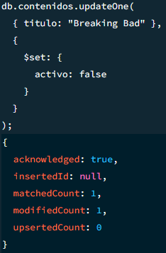
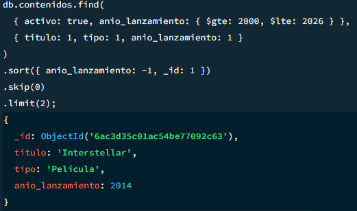
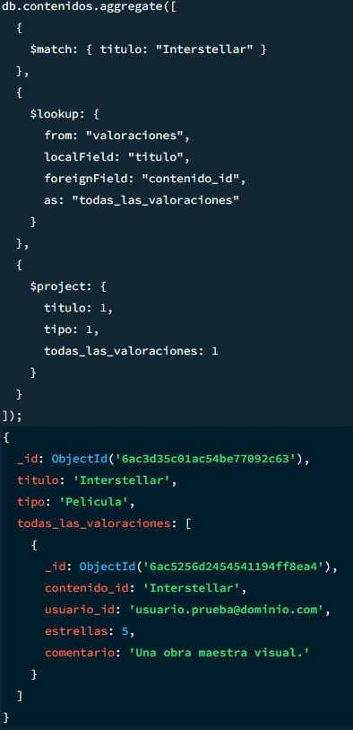
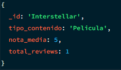

## Actividad 4: Resolver consultas y una agregación compleja

1. Inserción, actualización parcial y eliminación o desactivación lógica.

```JSON
// 1. Inserción
db.contenidos.insertOne({
  titulo: "Breaking Bad",
  tipo: "Serie",
  anio_lanzamiento: 2008,
  activo: true,
  metadatos: {
    duracion_minutos: 47
  }
});

// 2. Actualización parcial
db.contenidos.updateOne(
  { titulo: "Breaking Bad" },
  {
    $set: {
      "metadatos.director": "Vince Gilligan",
      anio_lanzamiento: 2009
    }
  }
);

// 3. Eliminación o desactivación lógica
db.contenidos.updateOne(
  { titulo: "Breaking Bad" },
  {
    $set: {
      activo: false
    }
  }
);
```

- Resultado de inserción
  
- Resultado de actualización
  
- Eliminación o desactivación lógica
  

2. Filtros conmbinados, ordenación y paginación estable

```json
db.contenidos.find(
  { activo: true, anio_lanzamiento: { $gte: 2000, $lte: 2026 } },
  { titulo: 1, tipo: 1, anio_lanzamiento: 1 }
)
.sort({ anio_lanzamiento: -1, _id: 1 }) 
.skip(0)
.limit(2);
```
- Filtros conmbinados, ordenación y paginación estable
  

3. Consulta con Referencia Mediante `$lookup`

La colección `ratings` tiene un campo `contenido_id`, que hace referencia al documento padre en la colección `contenidos`.
Para probarlo, he insertado una valoración de prueba, para facilitar dicha prueba, en vez de, usar un `Object_Id`, he usado el propio nombre de la película.

```json
db.valoraciones.insertOne({
  contenido_id: "Interstellar", // Referencia cruzada al contenido
  usuario_id: "usuario.prueba@dominio.com", 
  estrellas: 5,
  comentario: "Una obra maestra visual."
});
```
Entonces, ahora si nos queremos traer todas las valoraciones que hacen referencia a esta película, ejecutamos `$lookup`

```json
db.contenidos.aggregate([
  { 
    $match: { titulo: "Interstellar" }
  },
  {
    $lookup: {
      from: "valoraciones",     
      localField: "titulo", 
      foreignField: "contenido_id",
      as: "todas_las_valoraciones"
    }
  },
  {
    $project: {
      titulo: 1,
      tipo: 1,
      todas_las_valoraciones: 1
    }
  }
]);
```

- lookup
  

4. Agregación Compleja de 4+ Etapas con `$facet`

```json
db.contenidos.aggregate([
  // Etapa 1:
  { 
    $match: { activo: true } 
  },
  
  // Etapa 2 ($lookup): 
  {
    $lookup: {
      from: "valoraciones",
      localField: "titulo", 
      foreignField: "contenido_id",
      as: "datos_valoraciones"
    }
  },
  
  // Etapa 3 ($unwind):
  {
    $unwind: "$datos_valoraciones"
  },
  
  // Etapa 4 ($group): 
  {
    $group: {
      _id: "$titulo",
      tipo_contenido: { $first: "$tipo" },
      nota_media: { $avg: "$datos_valoraciones.estrellas" },
      total_reviews: { $sum: 1 }
    }
  },
  
  {
    $sort: { nota_media: -1 }
  }
]);
```

- Resultado `$facet`




5. Análisis de escalabilidad al crecer de los datos

El coste de rendimiento aumentaría drásticamente por dos motivos principales:

* Lentitud al cruzar datos ($lookup): Si la base de datos crece a millones de reviews, buscar cuáles pertenecen a cada película sería lentísimo. Para evitar que el servidor colapse, es estrictamente necesario que la colección de valoraciones tenga un índice en el campo contenido_id.

* Límite de memoria RAM ($unwind y $group): Desglosar los arrays y recalcular promedios masivos consume mucha memoria temporal. Si la consulta supera el límite de 100MB de RAM que MongoDB impone por defecto, fallará. Para solucionarlo, habría que permitir que el motor escriba temporalmente en el disco duro (usando el parámetro allowDiskUse: true), lo que salva la operación pero la vuelve más lenta.